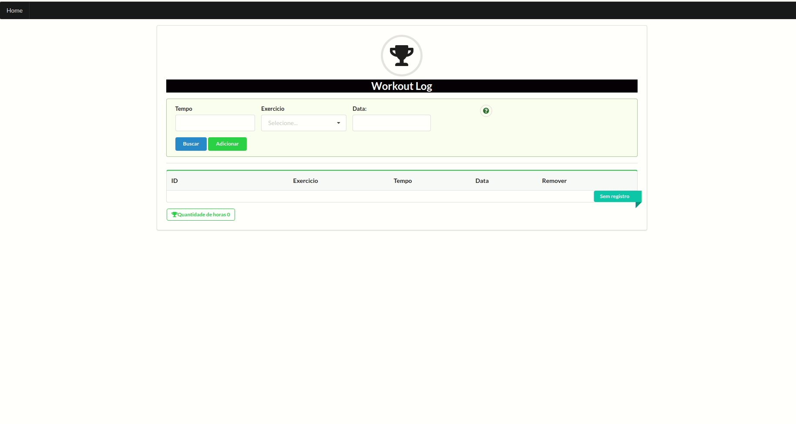

# WorkoutLog
[](https://gitlab.com/laiscarvalho/workoutlog)


 


WorktoutLog é uma page especializada em registrar, somar e exibir as atividade espotivas cadastradas.

  - Cadastro de atividades realizadas
  - Deletar atividade 
  - Filtrar Atividade 


### Tech Stack

o WorkoutLog usa uma série de projetos de código aberto para funcionar corretamente:

* [React] - React é uma biblioteca JavaScript de código aberto para construir interfaces de usuário ou componentes de IU. É mantido pelo Facebook e uma comunidade de desenvolvedores individuais e empresas.

* [Mobx] - O MobX é uma biblioteca para gestão de estado, o que significa que podemos utilizar ele para estados locais (páginas) ou globais (com Provider por exemplo). O MobX se baseia em observáveis, ações e reação, um conceito que vem da programação reativa.
 
* [Semantic-UI] - Semantic é uma biblioteca de componentes de interface do usuário (UI) implementada usando um conjunto de especificações baseadas na linguagem natural.

* [Typescript] - TypeScript é uma linguagem superset do ECMAScript 6 que, por sua vez, é um superset do ECMAScript 5, usada como base o JavaScript.


### Requisitos

* Node.js v10.19.0^

* NPM 6.14.4^


### Execução da aplicação

Baixe o repositorio no gitHub
```
git clone https://github.com/laiscarvalho/workoutlog
```

Entre na pasta do projeto 
```
cd workoutlog

```

Baixe os pacotes
```
npm install
```

E finalmente vamos colocar a aplicaçao para rodar
```
npm run start
```

### Execução de testes
Primeiro precisamos estar com os pacotes corretos, caso necessario baixe novamente
```
npm install
```

após a instalação rodar o comando de execução de testes
```
npm run test
```

### Monitoramento de erros
Foi utilizado o sentry que é uma aplicação open source para logar erros de aplicações e agregar informações a eles
